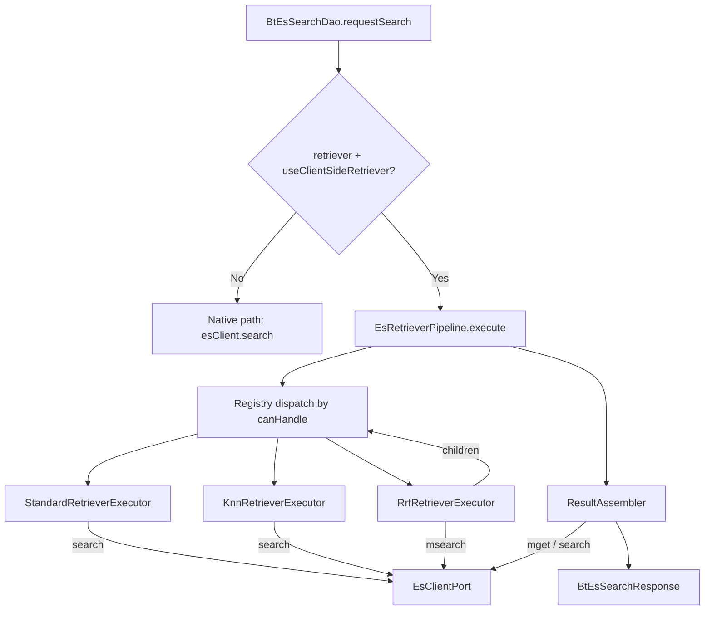

# Client-Side Retriever 구현 전략

> 작성일: 2026-04-26
> 상태: Approved — 구현 대기

## 1. 배경 / 문제

Elasticsearch `retriever` 프레임워크는 빌더 DSL로 편리하게 하이브리드 검색을 표현할 수 있으나, 상당 부분이 Platinum/Enterprise 라이센스를 필요로 한다. 본 라이브러리(`@es133/bt-ts-elasticsearch`)는 오픈소스 환경에서 동일한 빌더 API를 유지하면서 **실행만 클라이언트 측으로 옮겨** 라이센스 제약을 우회하는 것을 목표로 한다.

### 현재 상태

- 빌더는 구현되어 있음:
  - `src/es_retriever/EsAbstractRetriever.ts`
  - `src/es_retriever/EsStandardRetriever.ts`
  - `src/es_retriever/EsKnnRetriever.ts`
  - `src/es_retriever/EsRrfRetriever.ts`
  - `src/es_retriever/EsRetrieverBuilder.ts`
- 요청 직렬화: `src/bt_es_request/BtEsRequestUtil.ts` `buildRetrieverParam`가 네이티브 ES DSL 생성
- 요청 바디 주입: `src/bt_es_request/BtEsAbstractSearchRequest.ts:196-219` `getParam`
- 실행: `src/BtEsSearchDao.ts:10-13` — `esClient.search()`에 그대로 전달. ES 서버 의존 100%
- 기본 옵션: `search_type=query_then_fetch`, `track_total_hits=true`, `_source=false`
- 의존성: `@elastic/elasticsearch ^9.2.0` (msearch/mget 모두 사용 가능)

## 2. 목표

- 기존 빌더 API를 **변경 없이** 유지
- 실행 시 retriever를 client-side로 분해 실행 후 동일한 `BtEsSearchResponse` 반환
- ES Basic 라이센스만으로 동작
- 확장 가능 (향후 `text_similarity_reranker` 등 추가 여지)

## 3. 결정 사항 요약

| 항목 | 결정 |
|---|---|
| 스코프 | `standard` + `knn` + `rrf` |
| 기본 실행 경로 | Client-side. `useClientSideRetriever:false` 로만 네이티브 fallback |
| 페이징 | Stateless re-execution. 매 요청마다 전체 재실행 |
| `rank_window_size` / `k` 제약 위반 | 명시적 에러 (ES native와 동일 시맨틱) |
| `track_total_hits` | 존중 + hybrid. true + all-standard 자식: union 쿼리로 exact / true + knn or nested rrf 자식: gte 근사 / false: 후보 풀 크기만 |
| RRF + `sort`, RRF + `search_after` | 거부 (명시적 에러) |
| 빌더 API (`EsRetrieverBuilder` 등) | 변경 없음 |
| `BtEsRequestUtil.buildRetrieverParam` | 변경 없음 (네이티브 fallback 경로에서 재사용) |

## 4. 아키텍처 (Clean Architecture)



### 모듈 배치

```
src/es_retriever/
├─ EsAbstractRetriever.ts        (unchanged)
├─ EsStandardRetriever.ts        (unchanged)
├─ EsKnnRetriever.ts             (unchanged)
├─ EsRrfRetriever.ts             (unchanged)
├─ EsRetrieverBuilder.ts         (unchanged)
└─ executor/
   ├─ EsRetrieverExecutor.ts     (interface)
   ├─ EsRetrieverDispatcher.ts   (interface, DIP)
   ├─ EsClientPort.ts            (interface: search, msearch, mget)
   ├─ EsClientAdapter.ts         (wraps @elastic/elasticsearch Client)  [M7]
   ├─ RetrieverContext.ts        (type)
   ├─ RetrieverResult.ts         (type)
   ├─ EsRetrieverPipeline.ts     (registry + dispatch)
   ├─ executorHelpers.ts         (normalizeFilters, mapEsResponseToRetrieverResult)
   ├─ StandardRetrieverExecutor.ts
   ├─ KnnRetrieverExecutor.ts
   ├─ RrfRetrieverExecutor.ts    [M5]
   ├─ rrfMerge.ts                (pure function)  [M4]
   └─ ResultAssembler.ts         (source + highlight hydration)  [M6]

test/es_retriever/executor/      (mirror structure)
```

### 의존 방향

- `EsRetrieverPipeline` → `EsRetrieverExecutor[]` (추상)
- Executor → `EsClientPort` (추상) / retriever 빌더 (구체 타입 의존 허용, 이미 존재)
- `BtEsSearchDao` → `EsRetrieverPipeline` 생성 주입 / `EsClientAdapter`를 주입 받거나 `esClient`로부터 생성

## 5. 타입 설계

```ts
// RetrieverContext — 실행 컨텍스트
type RetrieverContext = {
  index: string | string[];
  from: number;
  size: number;
  trackTotalHits: boolean | number;
  sort?: Record<string, any>;
  postFilter?: EsQueryDsl;
  source?: boolean | string | string[] | { includes?: string[]; excludes?: string[] };
  highlight?: Record<string, any>;
  searchAfter?: Array<string | number>;
  parentFilter?: EsQueryDsl | EsQueryDsl[];  // RRF가 자식에 푸시다운할 때 사용
};

// RetrieverResult — executor가 반환
type RetrieverResult = {
  rankedIds: Array<{ id: string; index: string; score: number }>;
  total: { value: number; relation: 'eq' | 'gte' };
  sourceCache?: Map<string, EsHit>;  // 자식이 이미 _source를 가져왔을 때 재사용
};
```

## 6. Retriever별 실행 알고리즘

### 6.1 StandardRetriever

- ES `search` 1회. `from`/`size`/`sort`/`search_after` 모두 통과.
- `filter`, `collapse`, `min_score`, `terminate_after` 는 body로 매핑.
- `parentFilter` 가 있으면 `bool.filter`로 AND 결합.
- 비용: O(from+size) on ES.

### 6.2 KnnRetriever

- ES body:
  ```json
  { "knn": { "field":..., "query_vector":..., "k":..., "num_candidates":..., "filter":..., "similarity":... } }
  ```
- `parentFilter` 결합.
- 제약: `k >= from + size`. 미충족 시 에러.
- 클라이언트에서 `slice(from, from+size)`.

### 6.3 RrfRetriever

1. **제약 검증**
   - `rank_window_size >= from + size` 아니면 에러
   - `sort` 명시되면 에러
   - `searchAfter` 명시되면 에러
2. **Filter 푸시다운**: `rrf.filter` + `parentFilter` → 자식 실행 시 `parentFilter`로 주입
3. **자식 실행**: 각 자식을 `size=rank_window_size`, `_source`는 캐시 목적에 한해 true, `track_total_hits`는 컨텍스트 flag 그대로. msearch로 1회 호출 (M9 최적화)
4. **union total 계산 (track_total_hits가 truthy인 경우)**:
   - 모든 자식이 standard → `bool.should: [...], minimum_should_match:1` 을 msearch 슬롯으로 추가. `size:0, track_total_hits:true`. 반환된 total.value 사용, relation='eq'
   - 하나라도 knn/rrf → best-effort: Σ(child.total.value) — duplicate 카운트 가능. relation='gte'
5. **RRF 점수 계산** (`rrfMerge`):
   ```
   rrfScore(d) = Σᵢ 1 / (rank_constant + rankᵢ(d))   (d ∉ Rᵢ ⇒ 기여 0)
   ```
6. **정렬 & 슬라이스**:
   - score desc, tie-break = `index/id` 사전순 (결정적)
   - `slice(from, from+size)`
7. 반환. `_source`는 캐시에 있으면 포함. 없으면 `ResultAssembler`가 보강

## 7. 페이징 전략

### Strategy A — Stateless re-execution (채택)

매 페이지 요청 = 파이프라인 전체 재실행. 상태 보존 없음.

**흐름**:
```
1. validatePagination(retriever, from, size)   // 제약 위반시 throw
2. 각 자식: rank_window_size (or k) 만큼 fetch
3. 머지 → 정렬된 ID 리스트
4. slice(from, from+size) → 최종 ID
5. ResultAssembler가 _source/highlight 보강
```

**시맨틱**:
- 결정적 (같은 데이터 ⇒ 같은 결과)
- ES 네이티브와 동일
- 서버/클라이언트 둘 다 무상태

**한계**:
- 깊은 페이징은 `rank_window_size` 도 같이 커져야 함
- 매 페이지마다 자식 쿼리 반복 (V1에서 캐싱 없음)

### 각 Retriever별 페이징 비용

| Retriever | 네트워크 RT | ES 샤드 비용 | 클라 처리 |
|---|---|---|---|
| Standard | 1 | O(from+size) | - |
| KNN | 1 | O(k) | slice |
| RRF (N children, track=false) | 1 (msearch) + 1 (mget, 옵션) | O(N × rank_window_size) | merge + slice |
| RRF (N standard children, track=true) | 1 (msearch with union slot) + 1 (mget, 옵션) | O(N × rank_window_size + union) | merge + slice |
| RRF (knn/rrf child, track=true) | 1 (msearch) + 1 (mget, 옵션) | O(N × rank_window_size) | merge + slice + gte 추정 |

### 깊은 페이징 가이드 (README)

- 페이지 100을 보려면 `rank_window_size >= 100*size` → 자식당 1000+ 개 fetch 필요
- 일반적으로 retriever 결과 상위 20~50개가 사용자에게 의미 있음
- 깊은 페이징이 필요하면 별도 search 쿼리에서 `search_after` 사용 권장

## 8. `track_total_hits` Hybrid 전략

```
track_total_hits: true
  ├─ 모든 자식이 standard
  │   → union 쿼리 (bool.should minimum_should_match:1)를 msearch 에 추가
  │   → total.value = exact, relation = 'eq'
  └─ 자식에 knn 또는 nested rrf 포함
      → Σ(child.total.value) 또는 child total의 max
      → relation = 'gte' (중복 가능성 있으므로 최소 보장)

track_total_hits: false
  → totalCount = 머지된 unique 후보 수 (rankedIds.length)
  → relation = 'eq' (후보 풀에 한해)

track_total_hits: <number N>
  → 내부적으로 true 경로 실행 후 min(count, N) 반환
```

## 9. 제약 / 거부 정책

| 상황 | 동작 |
|---|---|
| `rank_window_size < from + size` (RRF) | throw Error |
| `k < from + size` (KNN) | throw Error |
| RRF + `sort` | throw Error |
| RRF + `search_after` | throw Error |
| KNN + `sort` / `search_after` | OK (ES native와 동일 통과) |
| Standard + `sort` / `search_after` | OK (ES에 통과) |

> 참고: ES 네이티브 top-level kNN은 `sort` 와 `search_after` 를 모두 허용한다 (sort 는 kNN score 정렬을 오버라이드, search_after 는 페이지네이션 보조). 본 라이브러리도 이 시맨틱을 유지한다.

에러 메시지 형식:
```
"rank_window_size(100) must be >= from(95) + size(10). Increase rank_window_size or narrow pagination."
```

## 10. 집계 / 하이라이트 / Source

- **Aggregations** (M8 구현):
  - **Standard / KNN 단독**: `body.aggregations` 에 inline 포함. ES 네이티브와 동일 시맨틱. 추가 RT 0.
  - **RRF**: 자식 컨텍스트에 aggs 전파 안 함. 머지 후 candidate pool ID 에 한정하여 `{ query: { ids: { values: [...] } }, size:0, aggregations: ... }` 추가 1회 발사.
  - **한계**: RRF aggs 스코프 = merged unique candidate pool (≤ Σ rank_window_size). ES native union 스코프보다 작음. README 에 명시.
- **Highlight**: 요청된 경우 `ResultAssembler` 가 `ids` 쿼리 + `highlight` 로 1회 보강 (RRF 경로). Standard / KNN 은 inline 처리되므로 추가 RT 없음.
- **_source**: Standard / KNN inline. RRF 자식이 inherit 받아 fetch. 부족한 항목만 `ResultAssembler` 가 mget 으로 보강 (highlight 없는 경우).

## 11. 테스트 전략 (TDD)

각 마일스톤마다 테스트 → 구현 → `npm test` green.

### 테스트 레이어

1. **Pure 함수 단위** (`rrfMerge`, DSL 변환): 결정적 입력 → 예상 출력.
2. **Executor 단위**: mock `EsClientPort` 주입하여 실제 ES 없이 검증.
3. **Pipeline 통합**: mock client로 end-to-end. `BtEsSearchResponse` 결과 검증.
4. **회귀**: 기존 `test/BtEsRequestUtil.spec.ts`의 native DSL 테스트는 모두 그대로 통과해야 함.

### 주요 테스트 케이스

#### rrfMerge
- 2개 자식, 공통 doc 존재: rank-based 합산 검증
- 한쪽에만 등장하는 doc 처리
- tie-break 결정성 (id 사전순)
- rank_constant 변화 효과
- 빈 자식, 단일 자식
- 중복 id 허용 안 됨 (dedup)

#### 페이징
- `[RRF] from=0, size=10, window=100` — 정상
- `[RRF] from=90, size=10, window=100` — 경계, 정상
- `[RRF] from=91, size=10, window=100` — 에러
- `[KNN] from=0, size=10, k=100` — 정상
- `[KNN] from=95, size=10, k=100` — 에러
- `[Standard] from=100, size=10` — ES에 그대로 통과

#### track_total_hits
- `[RRF+standard only] track=true` — union msearch 슬롯 존재, relation='eq'
- `[RRF+knn child] track=true` — relation='gte'
- `[RRF] track=false` — 후보 풀 크기만, relation='eq'
- `[RRF] track=500` — min(count, 500)

#### 거부 케이스
- RRF + sort → 에러
- RRF + search_after → 에러
- KNN + sort → 에러

## 12. 호환성 / 마이그레이션

- `BtEsAbstractSearchRequest` 에 `useClientSideRetriever?: boolean` getter/setter 추가 (기본 `true`)
- `BtEsSearchDao.requestSearch`:
  ```
  if (request.getRetriever() !== null && request.useClientSideRetriever) {
    return pipeline.execute(request);
  }
  return native path;
  ```
- `BtEsRequestUtil.buildRetrieverParam` 유지 (네이티브 경로에서 사용)
- 기존 테스트 영향 없음

## 13. 마일스톤

| ID | 내용 | Priority |
|---|---|---|
| M1 | 기반: `EsRetrieverExecutor` / `EsClientPort` 인터페이스, `EsRetrieverPipeline` 골격, `RetrieverContext`/`RetrieverResult` 타입 | high |
| M2 | `StandardRetrieverExecutor` (DSL 변환 + from/size/search_after/sort 통과) | high |
| M3 | `KnnRetrieverExecutor` (top-level knn 변환, parentFilter 푸시다운, k<from+size 에러) | high |
| M4 | `rrfMerge` 순수 함수 + 페이징 제약 검증 단위테스트 | high |
| M5 | `RrfRetrieverExecutor` (자식 실행 + filter 푸시다운 + sort/search_after 거부 + track_total_hits hybrid union 쿼리) | high |
| M6 | `ResultAssembler` (sourceCache 우선 + mget/search 보강 + highlight) | medium |
| M7 | `BtEsSearchDao` 통합 + `useClientSideRetriever` 플래그 기본 true | high |
| M8 | Aggs 정책 (머지된 id에 한정) + 한계 문서화 | medium |
| M9 | (선택) msearch 최적화: 같은 ES 대상 자식들 1회 round-trip | low |
| M10 | README/예제 업데이트 (페이징/totalCount 한계 명시) | low |

## 14. 한계 / 트레이드오프

- ES 샤드 단위의 partial-rank 최적화는 재현 불가 → 결과가 ES 네이티브와 미세하게 다를 수 있음 (정확성보다 가용성 우선)
- RRF + knn 자식이 포함된 경우 `track_total_hits`는 `gte` 근사만 제공
- 깊은 페이징은 `rank_window_size` 증가가 필수
- Aggregations는 retrieved id에 한정 (ES 네이티브와 시맨틱 다름)
- V1에서는 자식 결과 캐싱/커서 페이징 없음 (V2 후보)

## 15. V2 후보 (문서화만, 미구현)

- 자식 결과 client-side 캐싱 (TTL 기반)
- 커서 토큰 기반 페이징 (stateful, 네트워크 비용 감소)
- `text_similarity_reranker` scorer port (외부 모델 어댑터 인터페이스)
- msearch 최적화 확장 (cross-index routing)
